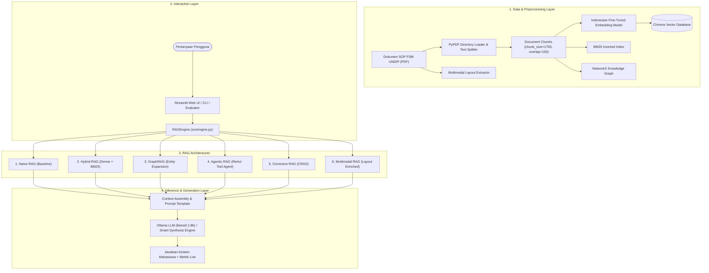
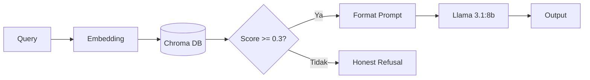
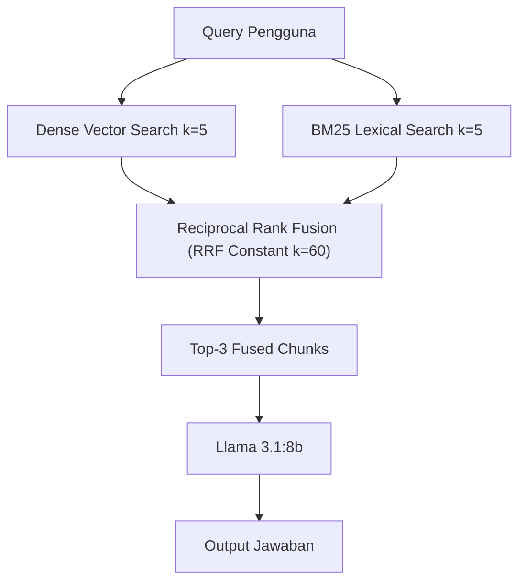
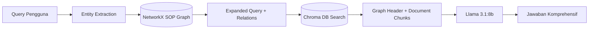
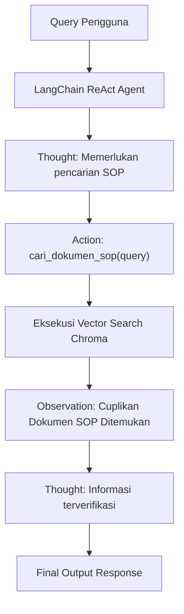
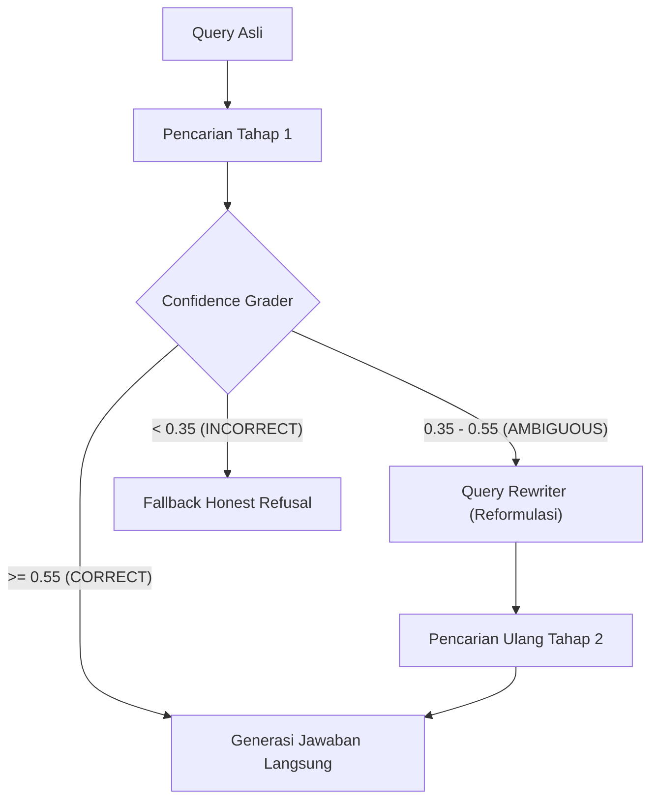

# 🏛️ Technical Architecture & Design Document (RAG Comparison)

Dokumen ini menjelaskan secara mendalam desain teknis, diagram alur data (*dataflow*), algoritma retrieval, dan mekanisme inferensi dari **6 Arsitektur Retrieval-Augmented Generation (RAG)** yang diimplementasikan dalam project ini.

---

## 📐 High-Level System Overview

Sistem Chatbot RAG ini dirancang untuk menjawab pertanyaan seputar Standar Operasional Prosedur (SOP) resmi Fakultas Sains dan Matematika Universitas Diponegoro (FSM UNDIP). Arsitektur terdiri dari 4 lapisan utama:

---

## 🔬 Rincian Teknis 6 Arsitektur RAG

### 1. Naive RAG (Baseline)
* **File Sumber**: `src/architectures/naive_rag.py` | `RAGEngine.execute_naive_rag`

#### Mekanisme Kerja:
1. **Embedding Query**: Kueri teks diubah menjadi vektor representasi 384-dimensi menggunakan model lokal `indo_finetuned_embedding`.
2. **Dense Similarity Search**: Menghitung *cosine similarity* terhadap seluruh dokumen di Chroma DB untuk mengambil top-$k$ chunk ($k=3$).
3. **Threshold Check**: Jika skor kemiripan tertinggi $< 0.30$, sistem secara otomatis menolak menjawab (*fallback refusal*) untuk mencegah halusinasi.
4. **LLM Generation**: Menyusun *prompt context* dari chunk yang lolos dan menghasilkan respons melalui `llama3.1:8b`.

---

### 2. Hybrid RAG (Dense + Sparse BM25 + Reciprocal Rank Fusion)
* **File Sumber**: `src/architectures/hybrid_rag.py` | `RAGEngine.execute_hybrid_rag`

#### Mekanisme Kerja:
Mengatasi keterbatasan pencarian semantik murni pada kueri yang membutuhkan pencocokan kata kunci eksak (misalnya nomor SOP, singkatan UKT/IRS, atau istilah spesifik).

1. **Dual Parallel Retrieval**:
   - **Dense Path**: Pencarian vektor semantik via Chroma DB ($k=5$).
   - **Sparse Path**: Pencarian berbasis leksikal menggunakan algoritma BM25Okapi ($k=5$).
2. **Reciprocal Rank Fusion (RRF)**:
   Menggabungkan kedua daftar peringkat dokumen menggunakan formula RRF:
   $$RRF\_Score(d) = \sum_{m \in \{dense, sparse\}} \frac{1}{k_{rrf} + \text{rank}_m(d)} \quad (\text{dengan } k_{rrf} = 60)$$
3. **Scoring & Context Assembly**: Mengambil top-$3$ chunk hasil peringkat fusi RRF dan mengurutkannya berdasarkan kemiripan kosinus sebelum dikirim ke LLM.

---

### 3. GraphRAG (Knowledge Graph Entity Expansion)
* **File Sumber**: `src/architectures/graph_rag.py` | `RAGEngine.execute_graph_rag`

#### Mekanisme Kerja:
Memanfaatkan struktur grafik pengetahuan (*Knowledge Graph*) berbasis **NetworkX** yang memetakan entitas kampus dan hubungan antar pihak/prosedur SOP.

1. **Entity Linking**: Mendeteksi node entitas dalam kueri (misal: *cuti akademik*, *legalisir*, *beasiswa*, *IRS*, *UKT*).
2. **Graph Traversal & Query Expansion**: Menelusuri tetangga (*1-hop neighbors*) pada graf relasi. Kueri asli diperluas dengan istilah relasional terkait (contoh: kueri *cuti akademik* diperluas dengan *izin cuti, aktif kembali, dekan, ketua program studi*).
3. **Graph Context Injection**: Struktur relasi yang ditemukan diformat sebagai *header context* eksplisit untuk membimbing pemahaman relasional LLM.

---

### 4. Agentic RAG (LangChain ReAct Tools Agent)
* **File Sumber**: `src/architectures/agentic_rag.py` | `RAGEngine.execute_agentic_rag`

#### Mekanisme Kerja:
Menggunakan paradigma **ReAct (Reasoning + Acting)** yang memungkinkan model LLM berpikir secara otonom untuk menentukan kapan dan bagaimana memanggil alat retrieval.

1. **Reasoning (Thought)**: Model menganalisis kebutuhan kueri pengguna.
2. **Action**: Mengeksekusi tool `cari_dokumen_sop(query)`.
3. **Observation**: Mengamati hasil dokumen yang diperoleh dan mengevaluasi kecukupan informasinya.
4. **Synthesis (Final Answer)**: Menyusun jawaban terverifikasi berdasarkan observasi aktual.

---

### 5. Corrective RAG / CRAG (Self-Correction & Query Rewriting)
* **File Sumber**: `src/architectures/corrective_rag.py` | `RAGEngine.execute_crag`

#### Mekanisme Kerja:
Menambahkan layer evaluator (*grader*) untuk menilai relevansi retrieval awal dan secara adaptif menentukan langkah koreksi:

* **Threshold Batas**:
  - Upper Threshold = $0.55$
  - Lower Threshold = $0.35$

* **Alur Keputusan**:
  1. **`CORRECT`** ($\text{Score} \ge 0.55$): Konteks sangat relevan, langsung dilanjutkan ke proses generasi.
  2. **`AMBIGUOUS`** ($0.35 \le \text{Score} < 0.55$): Konteks kurang meyakinkan; sistem mengaktifkan modul **Query Rewriter** untuk mereformulasi kueri dengan kata kunci yang lebih terarah, lalu melakukan pencarian ulang (*secondary retrieval*).
  3. **`INCORRECT`** ($\text{Score} < 0.35$): Dokumen tidak relevan sama sekali; sistem memicu *honest refusal* untuk menghentikan halusinasi.

---

### 6. Multimodal RAG (PDF Layout & Figure Descriptor Enrichment)
* **File Sumber**: `src/architectures/multimodal_rag.py` | `RAGEngine.execute_multimodal_rag`

#### Mekanisme Kerja:
SOP universitas sering kali memuat diagram alur (*flowcharts*), tabel alur kerja, dan bagan persetujuan. Multimodal RAG mengekstrak representasi struktural tersebut:

1. **Layout & Visual Indexing**: Selama inisialisasi, dokumen PDF dipindai untuk mendeteksi jumlah diagram alur, gambar kerja, dan representasi tabel data per halaman.
2. **Context Enrichment**: Setiap teks chunk yang diretrieve diinjeksi dengan metadata layout visual dari halaman aslinya (misal: `[INFORMASI VISUAL & LAYOUT: Mengandung 2 diagram alur kerja dan tabel persetujuan]`).
3. **Grounded Generation**: LLM memanfaatkan sinyal tata letak visual bersama teks untuk menghasilkan jawaban dengan pemahaman urutan alur SOP.

---

## 📊 Metrik Evaluasi Kuantitatif & Kualitatif

Pengujian dilakukan menggunakan dataset sintetis ground-truth SOP FSM UNDIP dengan kombinasi metrik:

| Kategori | Metrik | Deskripsi |
| :--- | :--- | :--- |
| **Token Overlap** | **ROUGE-1** | Overlap unigram antara jawaban model dan ground truth. |
| **Token Overlap** | **ROUGE-L** | Longest Common Subsequence (LCS) untuk konsistensi struktur kalimat. |
| **Semantic Similarity** | **BERTScore (F1)** | Kemiripan representasi semantik token-level berbasis transformer. |
| **RAG Evaluation** | **Ragas Faithfulness** | Proporsi klaim faktual dalam jawaban yang didukung oleh konteks retrieval (meminimalisir halusinasi). |
| **RAG Evaluation** | **Ragas Answer Relevance** | Tingkat kesesuaian dan kelengkapan jawaban terhadap kueri pengguna. |
