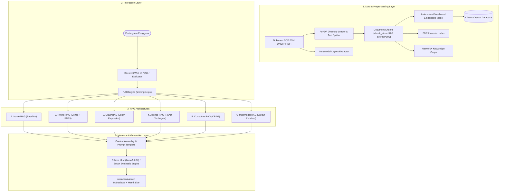
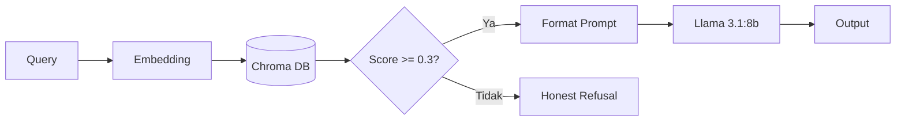
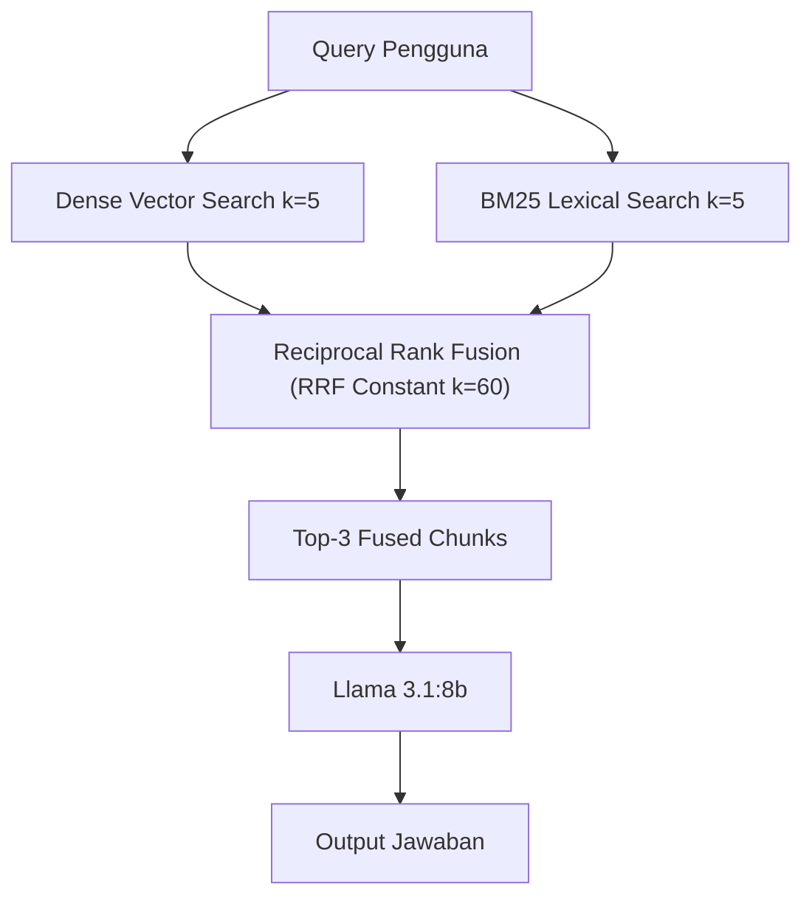
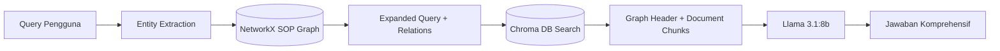
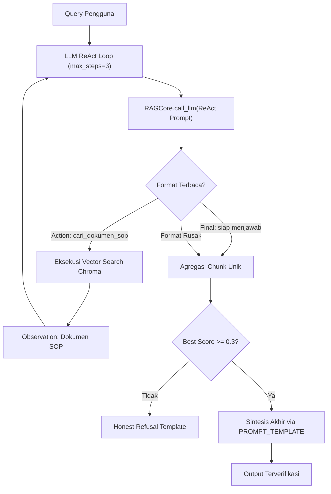
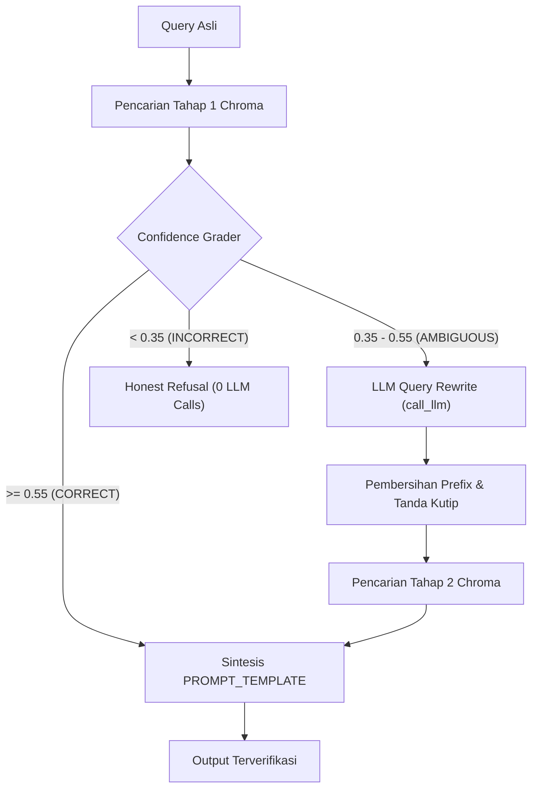
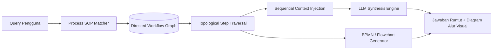
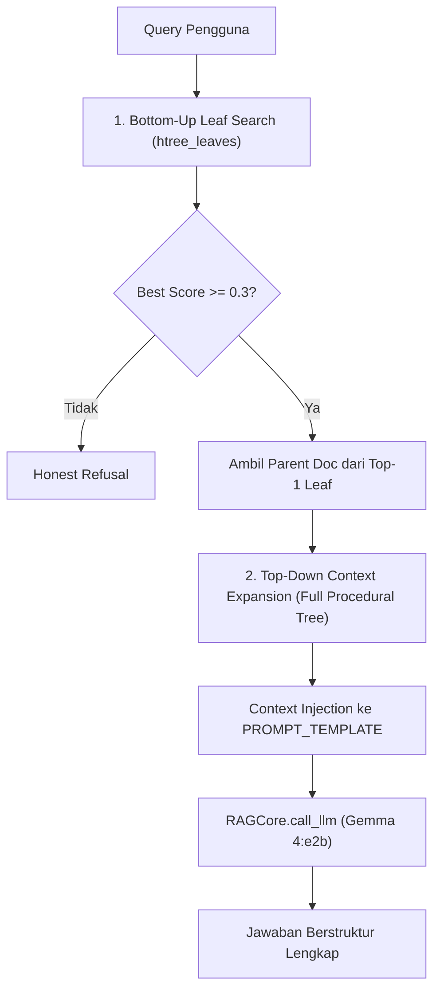

# 🏛️ Technical Architecture & Design Document (RAG Comparison)

Dokumen ini menjelaskan secara mendalam desain teknis, diagram alur data (*dataflow*), algoritma retrieval, dan mekanisme inferensi dari **6 Arsitektur Retrieval-Augmented Generation (RAG)** yang diimplementasikan dalam project ini.

---

## 📐 High-Level System Overview

Sistem Chatbot RAG ini dirancang untuk menjawab pertanyaan seputar Standar Operasional Prosedur (SOP) resmi Fakultas Sains dan Matematika Universitas Diponegoro (FSM UNDIP). Arsitektur terdiri dari 4 lapisan utama:

```mermaid
flowchart TD
    subgraph Data_Layer ["1. Data & Preprocessing Layer"]
        PDF["Dokumen SOP FSM UNDIP (PDF)"] --> Parser["PyPDF Directory Loader & Text Splitter"]
        Parser --> Chunks["Document Chunks (chunk_size=1700, overlap=100)"]
        Chunks --> FineTune["Indonesian Fine-Tuned Embedding Model"]
        FineTune --> ChromaDB[("Chroma Vector Database")]
        Chunks --> BM25Corpus["BM25 Inverted Index"]
        Chunks --> GraphBuilder["NetworkX Knowledge Graph"]
        PDF --> LayoutExtractor["Multimodal Layout Extractor"]
    end

    subgraph User_Layer ["2. Interaction Layer"]
        UserQuery(["Pertanyaan Pengguna"]) --> StreamlitApp["Streamlit Web UI / CLI / Evaluator"]
        StreamlitApp --> Engine["RAGEngine (src/engine.py)"]
    end

    subgraph Architecture_Layer ["3. RAG Architectures"]
        Engine --> ARCH1["1. Naive RAG (Baseline)"]
        Engine --> ARCH2["2. Hybrid RAG (Dense + BM25)"]
        Engine --> ARCH3["3. GraphRAG (Entity Expansion)"]
        Engine --> ARCH4["4. Agentic RAG (ReAct Tool Agent)"]
        Engine --> ARCH5["5. Corrective RAG (CRAG)"]
        Engine --> ARCH6["6. Multimodal RAG (Layout Enriched)"]
    end

    subgraph Generation_Layer ["4. Inference & Generation Layer"]
        ARCH1 & ARCH2 & ARCH3 & ARCH4 & ARCH5 & ARCH6 --> ContextFusion["Context Assembly & Prompt Template"]
        ContextFusion --> LLM["Ollama LLM (llama3.1:8b) / Smart Synthesis Engine"]
        LLM --> FinalAnswer["Jawaban Asisten Mahasiswa + Metrik Live"]
    end
```

---

## 🔬 Rincian Teknis 6 Arsitektur RAG

### 1. Naive RAG (Baseline)
* **File Sumber**: `src/architectures/naive_rag.py` | `RAGEngine.execute_naive_rag`

#### Mekanisme Kerja:
1. **Embedding Query**: Kueri teks diubah menjadi vektor representasi 384-dimensi menggunakan model lokal `indo_finetuned_embedding`.
2. **Dense Similarity Search**: Menghitung *cosine similarity* terhadap seluruh dokumen di Chroma DB untuk mengambil top-$k$ chunk ($k=3$).
3. **Threshold Check**: Jika skor kemiripan tertinggi $< 0.30$, sistem secara otomatis menolak menjawab (*fallback refusal*) untuk mencegah halusinasi.
4. **LLM Generation**: Menyusun *prompt context* dari chunk yang lolos dan menghasilkan respons melalui `llama3.1:8b`.

```mermaid
flowchart LR
    Q[Query] --> Emb[Embedding]
    Emb --> Chroma[(Chroma DB)]
    Chroma --> Filter{Score >= 0.3?}
    Filter -- Ya --> Prompt[Format Prompt]
    Filter -- Tidak --> Refusal[Honest Refusal]
    Prompt --> LLM[Llama 3.1:8b] --> Answer[Output]
```

---

### 2. Hybrid RAG (Dense + Sparse BM25 + Reciprocal Rank Fusion)
* **File Sumber**: `src/architectures/hybrid_rag.py` | `RAGEngine.execute_hybrid_rag`

#### Mekanisme Kerja:
Mengatasi keterbatasan pencarian semantik murni pada kueri yang membutuhkan pencocokan kata kunci eksak (misalnya nomor SOP, singkatan UKT/IRS, atau istilah spesifik).

1. **Dual Parallel Retrieval**:
   - **Dense Path**: Pencarian vektor semantik via Chroma DB ($k=5$).
   - **Sparse Path**: Pencarian berbasis leksikal menggunakan algoritma BM25Okapi ($k=5$).
2. **Reciprocal Rank Fusion (RRF)**:
   Menggabungkan kedua daftar peringkat dokumen menggunakan formula RRF:
   $$RRF\_Score(d) = \sum_{m \in \{dense, sparse\}} \frac{1}{k_{rrf} + \text{rank}_m(d)} \quad (\text{dengan } k_{rrf} = 60)$$
3. **Scoring & Context Assembly**: Mengambil top-$3$ chunk hasil peringkat fusi RRF dan mengurutkannya berdasarkan kemiripan kosinus sebelum dikirim ke LLM.

```mermaid
flowchart TD
    Q[Query Pengguna] --> Dense[Dense Vector Search k=5]
    Q --> Sparse[BM25 Lexical Search k=5]
    Dense --> RRF["Reciprocal Rank Fusion (RRF Constant k=60)"]
    Sparse --> RRF
    RRF --> TopK[Top-3 Fused Chunks]
    TopK --> LLM[Llama 3.1:8b] --> Answer[Output Jawaban]
```

---

### 3. GraphRAG (Knowledge Graph Entity Expansion)
* **File Sumber**: `src/architectures/graph_rag.py` | `RAGEngine.execute_graph_rag`

#### Mekanisme Kerja:
Memanfaatkan struktur grafik pengetahuan (*Knowledge Graph*) berbasis **NetworkX** yang memetakan entitas kampus dan hubungan antar pihak/prosedur SOP.

1. **Entity Linking**: Mendeteksi node entitas dalam kueri (misal: *cuti akademik*, *legalisir*, *beasiswa*, *IRS*, *UKT*).
2. **Graph Traversal & Query Expansion**: Menelusuri tetangga (*1-hop neighbors*) pada graf relasi. Kueri asli diperluas dengan istilah relasional terkait (contoh: kueri *cuti akademik* diperluas dengan *izin cuti, aktif kembali, dekan, ketua program studi*).
3. **Graph Context Injection**: Struktur relasi yang ditemukan diformat sebagai *header context* eksplisit untuk membimbing pemahaman relasional LLM.

```mermaid
flowchart LR
    Q[Query Pengguna] --> EntMatch[Entity Extraction]
    EntMatch --> Graph[(NetworkX SOP Graph)]
    Graph --> Expand[Expanded Query + Relations]
    Expand --> Chroma[(Chroma DB Search)]
    Chroma --> Fusion[Graph Header + Document Chunks]
    Fusion --> LLM[Llama 3.1:8b] --> Answer[Jawaban Komprehensif]
```

---

### 4. Agentic RAG (LangChain ReAct Tools Agent)
* **File Sumber**: `src/engine.py` | `RAGEngine.execute_agentic_rag`

#### Mekanisme Kerja:
Menggunakan paradigma **ReAct (Reasoning + Acting)** multi-langkah yang sepenuhnya dikendalikan oleh LLM melalui choke point `RAGCore.call_llm`:

1. **ReAct Execution Loop**:
   - Loop berjalan hingga maksimal `max_steps = 3` (dapat dikonfigurasi via CLI `--agentic-max-steps` dan dicatat di `run_config.json`).
   - Setiap langkah memanggil LLM dengan ReAct prompt yang menyajikan riwayat penalaran dan aksi sebelumnya.
   - Format respons LLM diparse secara toleran: `Thought:` / `Action: cari_dokumen_sop` / `Action Input:` / `Final: siap menjawab`.
   - Aksi diprioritaskan di atas terminasi `Final` pada langkah awal untuk mencegah terminasi prematur tanpa observasi. Format yang tidak terbaca dicatat secara aman dalam trace tanpa menyebabkan crash.
2. **Dynamic Tool Execution**:
   - Tool `cari_dokumen_sop(query)` mengeksekusi pencarian vektor dense ke Chroma DB yang sama ($k=3$) dengan kueri hasil penalaran LLM.
   - Observasi cuplikan dokumen dikembalikan ke LLM untuk pertimbangan di langkah berikutnya.
3. **Context Fusion & Threshold Check**:
   - Seluruh chunk unik yang dikumpulkan dari semua observasi ReAct digabungkan.
   - Threshold kosinus $0.30$ diterapkan pada skor terbaik. Jika di bawah threshold, sistem mengembalikan penolakan jujur (*honest refusal* template) tanpa memicu sintesis halusinatif.
4. **Grounded Synthesis**:
   - Jawaban akhir disintesis menggunakan `PROMPT_TEMPLATE` standar yang sama dengan arsitektur lain atas maksimal $k=3$ chunk teratas, menjamin keadilan evaluasi.

```mermaid
flowchart TD
    Input[Query Pengguna] --> Agent["LLM ReAct Loop (max_steps=3)"]
    Agent --> LLMCall["RAGCore.call_llm(ReAct Prompt)"]
    LLMCall --> Parse{Format Terbaca?}
    Parse -- "Action: cari_dokumen_sop" --> ToolExec["Eksekusi Vector Search Chroma"]
    ToolExec --> Obs["Observation: Dokumen SOP"] --> Agent
    Parse -- "Final: siap menjawab" --> Agg[Agregasi Chunk Unik]
    Parse -- Format Rusak --> Agg
    Agg --> Check{Best Score >= 0.3?}
    Check -- Tidak --> Refusal[Honest Refusal Template]
    Check -- Ya --> Synth["Sintesis Akhir via PROMPT_TEMPLATE"] --> Answer[Output Terverifikasi]
```

---

### 5. Corrective RAG / CRAG (Self-Correction & Query Rewriting)
* **File Sumber**: `src/engine.py` | `RAGEngine.execute_crag`

#### Mekanisme Kerja:
Menambahkan layer evaluator (*grader*) untuk menilai relevansi retrieval awal dan secara adaptif menentukan langkah koreksi:

* **Threshold Batas**:
  - Upper Threshold = $0.55$
  - Lower Threshold = $0.35$

* **Alur Keputusan**:
  1. **`CORRECT`** ($\text{Score} \ge 0.55$): Konteks sangat relevan, langsung dilanjutkan ke proses sintesis akhir via `PROMPT_TEMPLATE`.
  2. **`AMBIGUOUS`** ($0.35 \le \text{Score} < 0.55$): Konteks kurang meyakinkan. Sistem memicu modul **LLM Query Rewriter** menggunakan `REWRITE_PROMPT_TEMPLATE` lewat `RAGCore.call_llm`. Keluaran dibersihkan menjadi satu baris bersih (menghapus tanda kutip dan prefix seperti "Kueri baru:"), lalu dilakukan pencarian ulang (*secondary retrieval*) ke Chroma DB.
     - *Evaluation Mode*: Jika rewrite LLM gagal, sistem membangkitkan error eksplisit (`RuntimeError`) tanpa fallback ekstraktif diam-diam.
     - *Application Mode*: Jika rewrite gagal karena gangguan jaringan/Ollama, sistem fallback ke template heuristik dan menandainya secara eksplisit pada trace.
  3. **`INCORRECT`** ($\text{Score} < 0.35$): Dokumen tidak relevan sama sekali; sistem memicu *honest refusal* untuk menghentikan halusinasi tanpa memanggil LLM sintesis.

```mermaid
flowchart TD
    Q[Query Asli] --> Search1[Pencarian Tahap 1 Chroma]
    Search1 --> Grader{"Confidence Grader"}
    Grader -- ">= 0.55 (CORRECT)" --> Synth[Sintesis PROMPT_TEMPLATE]
    Grader -- "0.35 - 0.55 (AMBIGUOUS)" --> Rewriter["LLM Query Rewrite (call_llm)"]
    Rewriter --> Clean[Pembersihan Prefix & Tanda Kutip]
    Clean --> Search2[Pencarian Tahap 2 Chroma]
    Search2 --> Synth
    Grader -- "< 0.35 (INCORRECT)" --> Refusal["Honest Refusal (0 LLM Calls)"]
    Synth --> Answer[Output Terverifikasi]
```

---

### 6. Multimodal RAG (PDF Layout & Figure Descriptor Enrichment)
* **File Sumber**: `src/architectures/multimodal_rag.py` | `RAGEngine.execute_multimodal_rag`

#### Mekanisme Kerja:
SOP universitas sering kali memuat diagram alur (*flowcharts*), tabel alur kerja, dan bagan persetujuan. Multimodal RAG mengekstrak representasi struktural tersebut:

1. **Layout & Visual Indexing**: Selama inisialisasi, dokumen PDF dipindai untuk mendeteksi jumlah diagram alur, gambar kerja, dan representasi tabel data per halaman.
2. **Context Enrichment**: Setiap teks chunk yang diretrieve diinjeksi dengan metadata layout visual dari halaman aslinya (misal: `[INFORMASI VISUAL & LAYOUT: Mengandung 2 diagram alur kerja dan tabel persetujuan]`).
3. **Grounded Generation**: LLM memanfaatkan sinyal tata letak visual bersama teks untuk menghasilkan jawaban dengan pemahaman urutan alur SOP.

---

## 📊 Metrik Evaluasi Kuantitatif & Kualitatif

Pengujian dilakukan menggunakan dataset sintetis ground-truth SOP FSM UNDIP dengan kombinasi metrik:

| Kategori | Metrik | Deskripsi |
| :--- | :--- | :--- |
| **Token Overlap** | **ROUGE-1** | Overlap unigram antara jawaban model dan ground truth. |
| **Token Overlap** | **ROUGE-L** | Longest Common Subsequence (LCS) untuk konsistensi struktur kalimat. |
| **Semantic Similarity** | **BERTScore (F1)** | Kemiripan representasi semantik token-level berbasis transformer. |
| **RAG Evaluation** | **Ragas Faithfulness** | Proporsi klaim faktual dalam jawaban yang didukung oleh konteks retrieval (meminimalisir halusinasi). |
| **RAG Evaluation** | **Ragas Answer Relevance** | Tingkat kesesuaian dan kelengkapan jawaban terhadap kueri pengguna. |

---

### 7. Workflow GraphRAG (Process / Workflow State-Machine DAG)
* **File Sumber**: `src/architectures/workflow_graph_rag.py` | `src/graph_sop/workflow_graph.py` | `RAGEngine.execute_workflow_graph_rag`

#### Mekanisme Kerja:
Mengatasi batasan graf entitas biasa yang tidak memiliki arah kronologis. Memetakan langkah-langkah SOP sebagai Directed Acyclic Graph (DAG) state-machine:
1. **Process Matching**: Mencocokkan kueri dengan simpul SOP induk (root).
2. **Sequential Step Traversal**: Menelusuri seluruh simpul langkah secara topologis ($L_1 \to L_2 \to \dots \to L_N$).
3. **Swimlane Actor & Artifact Extraction**: Mengekstrak aktor pelaksana, dokumen prasyarat, dan dokumen luaran per tahap.
4. **Automated BPMN / Mermaid Generation**: Menghasilkan sintaks bagan alur Mermaid yang dapat dirender visual interaktif pada UI.

**Isi graf (sejak Goal A, Tugas 1):** 44 simpul langkah, satu per langkah bernomor di PDF (Cuti 8, Legalisir 6, IRS 6, UKT 11, Aktif 3, Beasiswa 5, Ormawa 5), masing-masing dengan kutipan `evidence` verbatim dari PDF. `actor` = subjek kalimat PDF; `inputs`/`output`/`duration` hanya diisi dari baris *Dokumen yang dibutuhkan* / *Output:* / *Waktu:* PDF. Rincian dan versi lama (42 simpul): `docs/GRAPH_PDF_RECONCILIATION.md`, `docs/workflow_graph_v1.json`. Sidik graf (`workflow_graph_sha256`) dicatat di `run_config.json`.

```mermaid
flowchart LR
    Q[Query Pengguna] --> Match[Process SOP Matcher]
    Match --> DAG[(Directed Workflow Graph)]
    DAG --> Seq[Topological Step Traversal]
    Seq --> Mermaid[BPMN / Flowchart Generator]
    Seq --> Context[Sequential Context Injection]
    Context --> LLM[LLM Synthesis Engine]
    LLM --> Out[Jawaban Runtut + Diagram Alur Visual]
    Mermaid --> Out
```

---

### 8. Hierarchical Tree RAG (Parent Document Tree Chunking & Leaf Retrieval)
* **File Sumber**: `src/engine.py` | `src/graph_sop/hierarchical_chunker.py` | `RAGEngine.execute_hierarchical_rag`

#### Mekanisme Kerja:
Mengatasi problem *parent-orphan chunking* dan hilangnya konteks global SOP saat pencarian berbasis potongan kecil:

1. **Hierarchical Tree Parsing (`SOPHierarchicalChunker`)**:
   - Memetakan setiap SOP ke dalam pohon relasional: Root (Dokumen) $\to$ Section (Ketentuan Umum & Ringkasan) $\to$ Children (Langkah-Langkah Prosedur).
   - Parser mempertahankan kontinuitas kalimat langkah: baris lanjutan kalimat langkah digabung ke teks prosedur, sedangkan atribut metadata (`Dokumen yang dibutuhkan:`, `Output:`, `Link unduh form:`, `Waktu:`) diisolasi ke atribut detail.
   - Menghasilkan tepat 44 langkah terverifikasi dari 7 dokumen PDF SOP (Cuti 8, Aktif 3, Legalisir 6, IRS 6, UKT 11, Beasiswa 5, Ormawa 5) dan 51 leaf chunk (7 ringkasan dokumen + 44 langkah terperinci).
2. **Dedicated Leaf Chunk Indexing (`htree_leaves`)**:
   - 51 leaf chunk diindeks ke koleksi Chroma terpisah bernama `htree_leaves` menggunakan model embedding yang sama dengan arsitektur lain.
   - Setiap leaf chunk diperkaya dengan metadata konteks induk (`DOKUMEN INDUK`, `BAGIAN`, `ISI PROSEDUR`, `DETAIL & ATRIBUT`).
3. **Bottom-Up Retrieval & Top-Down Expansion**:
   - Kueri pengguna dicari secara *dense top-k* ($k=3$) langsung pada koleksi `htree_leaves`.
   - Threshold kosinus $0.30$ diterapkan pada skor terbaik. Jika di bawah threshold, sistem menolak jujur (*honest refusal*).
   - Jika lolos threshold, dokumen induk dari leaf peringkat 1 diidentifikasi (`top_doc.metadata["source"]`).
   - Sistem memperluas konteks ke seluruh pohon dokumen SOP induk tersebut (`get_hierarchical_context_for_doc`), menyertakan ringkasan umum dan seluruh sub-langkah beserta atribut detailnya.
4. **Hierarchical Synthesis**:
   - Konteks pohon lengkap diinjeksikan ke `PROMPT_TEMPLATE` dan disintesis lewat `RAGCore.call_llm`.
5. **Ablation Baseline (`htree_v0`)**:
   - Versi lama sebelum perbaikan dipertahankan sebagai sistem pembanding `htree_v0` (`execute_hierarchical_rag_v0`).
   - `htree_v0` melakukan retrieval awal pada chunk dokumen standar (1.700 karakter) sebelum memperluas pohon, memungkinkan pembuktian empiris mengenai manfaat *leaf-level chunking* vs *document-level chunking*.

```mermaid
flowchart TD
    Q[Query Pengguna] --> LeafSearch["1. Bottom-Up Leaf Search (htree_leaves)"]
    LeafSearch --> Check{Best Score >= 0.3?}
    Check -- Tidak --> Refusal[Honest Refusal]
    Check -- Ya --> Top1["Ambil Parent Doc dari Top-1 Leaf"]
    Top1 --> TreeExp["2. Top-Down Context Expansion (Full Procedural Tree)"]
    TreeExp --> Prompt["Context Injection ke PROMPT_TEMPLATE"]
    Prompt --> LLM["RAGCore.call_llm (Gemma 4:e2b)"]
    LLM --> Answer[Jawaban Berstruktur Lengkap]
```

---

## 🔒 Centralized LLM Traceability & Zero Silent Fallback

Untuk menjamin keadilan protokol eksperimen dan evaluasi terukur pada RQ3:

1. **LLM Invocation Choke Point (`RAGCore.call_llm(prompt) -> str`)**:
   - Seluruh pemanggilan LLM pada semua arsitektur—mulai dari sintesis jawaban akhir, loop ReAct pada Agentic RAG, hingga query rewriting pada CRAG—wajib melewati satu metode terpusat `call_llm`.
   - Di lingkungan evaluasi (`evaluate_benchmark.py`), fungsi ini di-patch untuk mencatat jumlah panggilan LLM, token masukan (*prompt tokens*), token keluaran (*completion tokens*), latensi per panggilan, dan error aktual.
2. **Zero Silent Extractive Fallback**:
   - Mode evaluasi mengaktifkan `RAGCore.disable_extractive_fallback = True`.
   - Jika inferensi LLM gagal (timeout, crash, atau respons kosong), baris evaluasi dicatat sebagai `llm_error` atau error eksplisit dan tidak pernah digantikan secara diam-diam oleh teks salinan konteks retrieval.
   - Fallback heuristik hanya diizinkan pada aplikasi interaktif Streamlit, dan wajib ditandai secara eksplisit pada trace.

